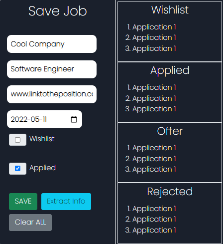

# Pinwheel

Minimal, lightweight chrome extension platform that helps keep track of job postings that users have applied to or are interested in applying. 

Features: Users can create, save, edit, and delete job postings that they are interested in, along with the date that they applied. The convenience of simply clicking on an extension without the need to change tabs or switch windows to a spreadsheet allows users to quickly and efficiently keep track of their applications, without becoming lost with where they applied.

Users will be able to input their job information like this:

They can choose whether to wishlist the job application for later use, or directly apply in that current period of time. Users can also organize their applications based on if they get an offer, or were rejected from an offer.
